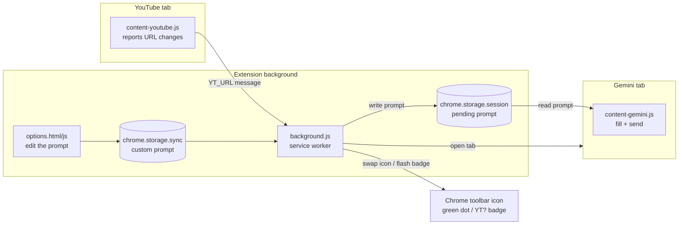
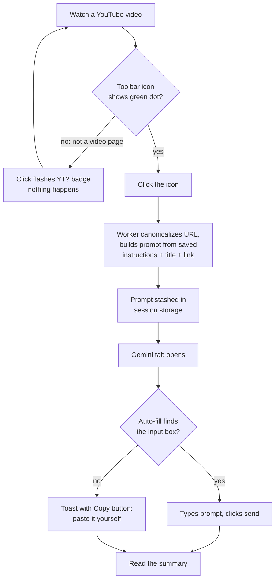
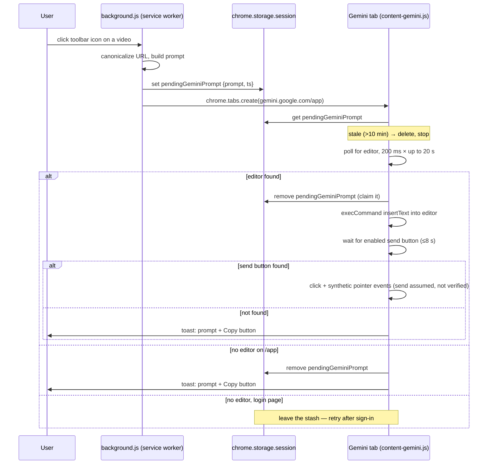

# How It Works

## What it is

This is a small Chrome extension that adds one button to your browser. While you're watching a YouTube video, you click the button, and a new tab opens with Google's Gemini AI already asked to summarize that exact video — the question is typed in and sent for you. It's for anyone who wants the gist of a video without watching all of it, and without copy-pasting links around.

## The building blocks, from zero

**Browser extension.** A small program you install *into* Chrome that adds features Chrome doesn't have. Think of it like a Lego brick you snap onto the browser. Chrome keeps extensions in a sandbox: each one has to declare up front which websites it wants to touch, and it can't touch anything else.

**Manifest V3 (MV3).** Every extension has a file called `manifest.json` — its ID card. It tells Chrome the extension's name, what permissions it needs, and which scripts to run where. "V3" is just the current version of the rules Chrome makes extensions follow. Ours is at `manifest.json` and declares three permissions: `storage` (save small bits of data), `activeTab` (a temporary pass to look at whichever tab you clicked the button on), and `clipboardWrite` (copy text for you). Separately, it asks for standing access to exactly two sites — YouTube and Gemini (these site grants are called *host permissions*).

**Service worker.** The extension's brain (`background.js`). It's a script that runs in the background, *not* inside any web page. Chrome wakes it up when something happens (you click the button, a message arrives) and puts it back to sleep when it's idle — like a helper who naps until you ring a bell. Because it naps, it can't hold things in its head for long; anything it needs to remember must be written down in storage.

**Content script.** A script the extension injects *into* a specific website's page, where it can see and change that page. This extension has two:

- `content-youtube.js` runs on YouTube pages. Its only job is to tell the brain what URL you're on.
- `content-gemini.js` runs on Gemini pages. Its job is to type the question in and press send.

**The DOM.** When a page loads, the browser turns its HTML into a live tree of elements — buttons, text boxes, paragraphs — called the DOM (Document Object Model). Scripts can search this tree ("find me the text box") and poke it ("put this text in, click that button"). That's exactly how the Gemini content script "types" for you: it's not pressing your keyboard, it's editing the tree the same way your keystrokes would.

**Extension storage.** Chrome gives extensions a few small notepads:

- `chrome.storage.sync` — survives restarts and, if you use Chrome's sync feature, follows you to your other computers. Used for your custom prompt (`options.js:19`).
- `chrome.storage.session` — wiped when the browser closes. Used as a short-lived hand-off note between the brain and the Gemini script (`background.js:76`).

## The whole trip, end to end

**Step 0 — the green dot.** YouTube is a "single-page app": clicking between videos doesn't reload the page, it just swaps content in place. So `content-youtube.js` reports the current URL to the service worker on load *and* on YouTube's in-app navigation events (`yt-navigate-finish`, `yt-page-data-updated`, `popstate` — `content-youtube.js:17-22`). The worker checks whether that URL looks like a single video and swaps the toolbar icon to a variant with a small green dot baked into the image (`background.js:50-54`). Green dot = "this URL is a video I recognize" — it checks only the URL, so it can't know yet whether you're signed into Gemini. One quirk: the URL checker also accepts `music.youtube.com` links (`lib.js:30`), but this reporter script only runs on regular and mobile YouTube (`manifest.json`), so YouTube Music tabs never get the dot — clicking the button there still works.

**Step 1 — you click the button.** The service worker wakes up (`background.js:64`). It takes the tab's URL and *canonicalizes* it — converts any of the many spellings of a YouTube link (`youtu.be/ID`, `/shorts/ID`, `/live/ID`, `/embed/ID`, `m.youtube.com`, `music.youtube.com`) into the one standard form `https://www.youtube.com/watch?v=ID`, or `null` if it's not a single video (`lib.js:14-46`). A video ID is exactly 11 characters from the set letters, digits, `-`, `_`; that's the test. Not a video? A brief red `YT?` badge flashes on the icon and nothing else happens (`background.js:67`).

**Step 2 — build the prompt.** The worker loads your saved instructions (or the default, just `Summarize the video:`) and appends the video's title and canonical link (`lib.js:59-63`). The title comes from the tab title, cleaned of YouTube's decorations like a leading unread count `(3) ` and the trailing ` - YouTube` (`lib.js:50-55`).

**Step 3 — the hand-off.** Here's the puzzle: the service worker is about to open a Gemini tab, but it has no hands inside web pages (only content scripts do), and it might be back asleep by the time the page loads. Solution: it writes the prompt onto the session notepad under the key `pendingGeminiPrompt`, with a timestamp (`background.js:76`), then opens `gemini.google.com/app` (`background.js:77`). Two wrinkles. First, that notepad is normally readable only by the extension's own pages — and content scripts, which live inside other websites, don't qualify — so the worker first flips a switch (`setAccessLevel`) letting them read it too (`background.js:10-22`). Second, there is only one note: click summarize on two videos back-to-back and the second note replaces the first before its tab reads it.

**Step 4 — auto-fill and send.** The Gemini tab loads, and `content-gemini.js` starts. It reads the notepad; no note, or a note older than 10 minutes, means nothing to do (`content-gemini.js:123-129`). Otherwise it hunts for Gemini's input box, fills it, and clicks send. Details in the next section, because this is the fragile part.

**Step 5 — done.** The click is fired and the extension's part in this request is over. It doesn't watch to confirm Gemini actually accepted the prompt — it trusts the click; if the send button never appeared you'd have gotten the fallback pop-up instead.

## The hard part: filling a page that wasn't built for it

Gemini has no official "open with this question pre-typed" URL. So the extension does what a very fast human would do: find the text box in the DOM, type, click send. Google can rename or restructure those elements any day without telling anyone, so the script is built defensively:

1. **Ordered fallback selectors.** A *selector* is a search pattern for finding elements in the DOM (like `button[aria-label*="send"]` — "a button whose label mentions send"). The script tries a fixed list of them in order (`content-gemini.js:9-21`); one Google rename doesn't kill it, because a later pattern in the list may still match.
2. **Waiting with a deadline.** The input box only appears once Gemini's app finishes starting up, so the script checks for it every 200 ms for up to 20 seconds — repeated checking like this is called *polling* (`content-gemini.js:37-45`). If no box ever appears *and* the address path is `/app`, the script gives up and shows the fallback (it can't actually tell a broken selector from a page that simply never finished loading — the path check is its best guess). On a login page it leaves the note alone, so the reload after you sign in gets a second chance (`content-gemini.js:132-140`).
3. **Claim before send.** The moment the box is found, the script deletes the note (`content-gemini.js:144`), so a second Gemini tab reading afterwards won't re-send it. This isn't a true lock — two tabs reading at the exact same instant could both send — but in normal use the extension opens only one tab per click.
4. **Typing the page believes.** Silently swapping a text box's content can leave the page's own code unaware anything was typed. The script uses `document.execCommand('insertText')`, which makes the browser fire the same "something was typed" notifications (*input events*) that real keystrokes trigger, so Gemini's code notices the text; if that fails, it sets the text directly and fires one such notification by hand (`content-gemini.js:47-65`). The send click adds a burst of synthetic mouse/pointer-style events on top of a plain `.click()`, because Google's Material buttons sometimes ignore bare clicks (`content-gemini.js:67-73`). None of this is genuine keyboard or mouse input — it's page-level imitation that most web apps accept.
5. **Visible failure over silent failure.** If the visible steps fall through — no box found on the app page, or the send button never becomes enabled — a small dark *toast* (a corner pop-up) appears containing the full prompt in a text box plus a Copy button, so the worst case is one manual paste (`content-gemini.js:75-120`, used at `content-gemini.js:137,152,155`). One genuinely silent gap remains: if reading storage itself fails, the script just stops (`content-gemini.js:159`).

## Why it's built this way

- **Session-storage hand-off instead of a direct message:** the service worker may be asleep by the time the Gemini page finishes loading, and a message sent before that page is ready would land on nobody. A note in storage waits patiently; a message can miss its moment.
- **Canonicalize URLs in one shared function:** YouTube links come in at least six shapes; normalizing them in `lib.js` means one tested code path decides "is this a video?" for both the green dot and the click.
- **`lib.js` has no DOM and no `chrome.*` calls:** that means Node.js (a program that runs JavaScript outside any browser) can load it directly, so the tricky logic (URL parsing, title cleanup, prompt building) gets checked automatically by the tests in `test/lib.test.mjs` (`npm test`) without ever opening Chrome. Those tests cover only this file — the browser-side behavior is not auto-tested.
- **Icon swap instead of Chrome's badge for the green dot:** Chrome's built-in badge is a large colored rectangle with text; a subtle dot isn't possible with it, so two icon sets are shipped and swapped per-tab (`background.js:34-46`). The badge is still used for the transient `YT?` error flash, where loud is fine.
- **Brief default prompt:** `Summarize the video:` and nothing more, because Gemini picks a better structure on its own than a heavily prescribed format (`lib.js:4-6`). Your title and link are appended automatically so a custom prompt never has to include them.

## Diagrams

System overview — the three scripts, where they live, and what connects them.

Core user loop — from watching a video to reading the summary.

The auto-fill handshake — the hardest area, as a sequence with its failure branches.

## Install and run

Not on the Chrome Web Store; install from source ("load unpacked" — pointing Chrome at the raw folder instead of a packaged download):

1. Clone or download the repo.
2. Open `chrome://extensions`, turn on **Developer mode**.
3. **Load unpacked** → select the project folder.
4. Pin the extension (puzzle icon → pin) so the button is visible. A welcome page opens on first install explaining this, because Chrome gives extensions no way to pin themselves (`background.js:56-62`).

You must be signed into Gemini in the same browser. For distribution, `tools/pack.sh` builds into `dist/` a `.zip` (the format the Chrome Web Store accepts for uploads) and — only when Chrome is found at its macOS path — a signed `.crx` (a self-contained installable package). Landing page: https://yili.dev/projects/youtube_summary_with_gemini/ (linked from the options page).

## Limitations

- In practice Gemini can only watch **public** videos. That's Gemini's behavior, not the extension's — the extension always sends the same prompt (instructions + title + link) and never checks a video's visibility.
- If Google reshuffles Gemini's page structure past all the fallback selectors, auto-fill degrades to the copy-paste toast until `EDITOR_SELECTORS` / `SEND_SELECTORS` in `content-gemini.js` are updated.
- The source contains no analytics, tracking, or developer server — nothing is ever sent to the developer. Your Gemini conversation is between you and Google, and your saved prompt may travel through Chrome's own sync service if you have Chrome sync enabled (see `PRIVACY.md`).
